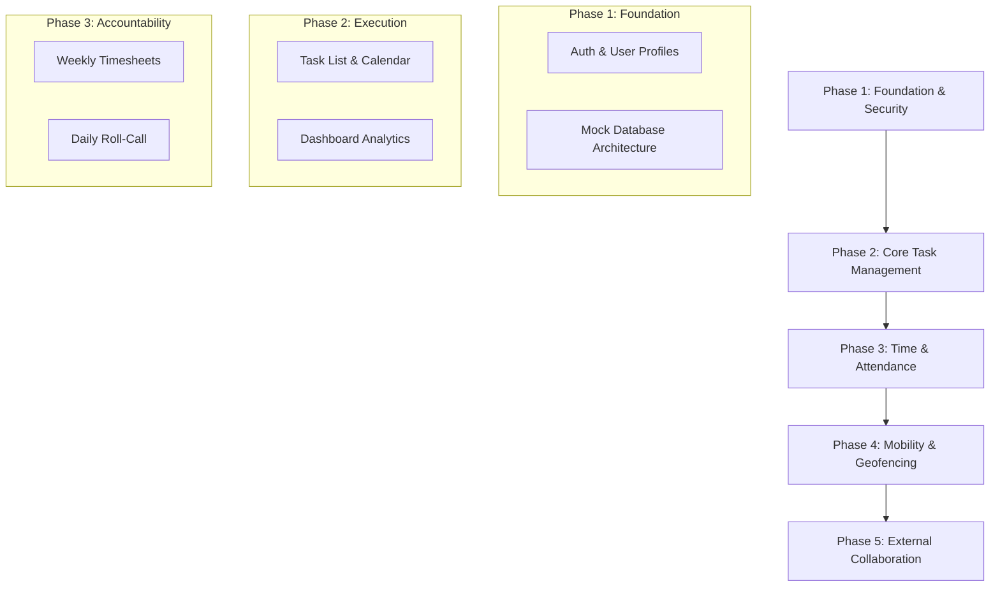

# Comprehensive Project Proposal: Operational Control Center (OCC) Rev5

**Prepared for:** [Customer Name]
**Project Title:** OCC Rev5 - Enterprise Resource & Task Orchestration
**Date:** January 2, 2026

---

## 🚀 1. Vision Statement
The Operational Control Center (OCC) Rev5 is a next-generation platform designed to unify project lifecycle management, workforce optimization, and real-time operational visibility. By bridging the gap between high-level portfolio management and ground-level task execution, OCC Rev5 empowers organizations to achieve peak efficiency with data-driven precision.

## 💎 2. The Core Solution Pillars

### 📊 Modern Intelligence Dashboard
Transform raw data into actionable insights.
- **Pulse Monitoring**: Real-time project health and task status tracking.
- **Efficiency Analytics**: Visual graphs representing time efficiency and resource utilization.
- **Automated Summaries**: High-level overviews for executives and detailed daily summaries for team members.

### 📋 Advanced Task & Resource Orchestration
Precision management of every project component.
- **Dynamic Task Views**: Switch between High-Performance List Views and Interactive Calendar Views.
- **Granular Task Details**: Comprehensive tracking of planned vs. actual durations, costs, and checklist-based execution.
- **Resource Leveling**: Intelligent assignment of tasks to internal staff and external contractors.

### 🕒 Integrated Time & Attendance (T&A) Suite
Accountability from the office to the site.
- **Automated Timesheets**: Unified weekly logging for all personnel.
- **Mobile Roll-Call**: Rapid GPS-verified check-ins for site managers and general workers.
- **Compliance Tracking**: Automated handling of sick leave, leave-early reasons, and medical documentation.

### 🌐 Secure Geofencing & Connectivity
Verifiable presence and seamless collaboration.
- **GPS Verification**: Location-aware task execution ensuring site managers are where they need to be.
- **External Partner Portal**: Secure role-based access for external contractors to update progress directly.
- **Cross-Platform Access**: Consistent experience across desktop and mobile devices.

---

## 🛠️ 3. Strategic Implementation Roadmap

---

## 📈 4. Projected Business Impact

| Strategic Goal | Expected Outcome |
| :--- | :--- |
| **Operational Costs** | Reduction in administrative overhead through automated T&A and reporting. |
| **Data Accuracy** | eliminated "Paper-to-Digital" lag with real-time site updates. |
| **Resource Optimization** | Improved ROI on contractor spend through precise hour and cost tracking. |
| **Project Transparency** | 100% visibility into project delays and milestone health. |

---

> [!IMPORTANT]
> This proposal covers the end-to-end scope of the OCC Rev5 platform. We are currently transitioning from Phase 3 to Phase 4, with core T&A functionality now ready for pilot testing.
